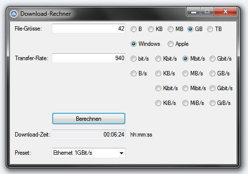

# Download-Rechner
Calculates the time to download/copy a file when provided with the respective file size and download/copy rate.

It provides some hard coded presets for the download/copy rate:

* XDCAM HD 422
* Ethernet 100MBit/s
* Ethernet 1GBit/s
* FireWire 400
* FireWire 800
* Thunderbolt (2)
* Thunderbolt 3
* USB 1.1
* USB 2.0
* USB 3.0
* USB-C (3.1)
